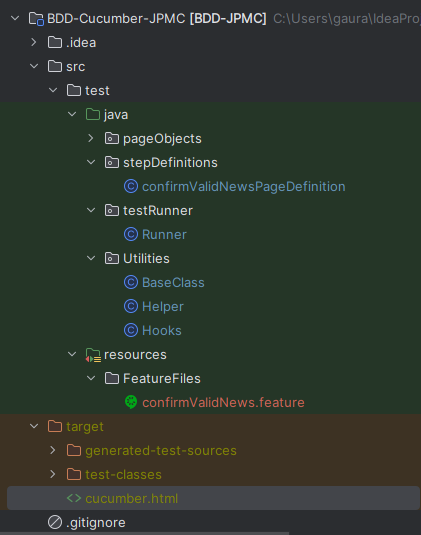
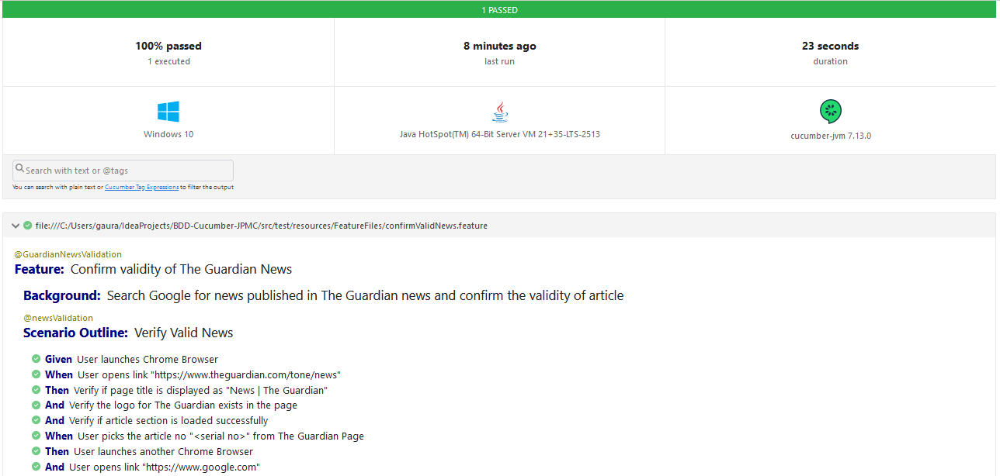

# BDD-Cucumber-Automation-Framework

Cucumber is a BDD Tool, and Selenium WebDriver is used for the automation of web applications.
BDD mainly focuses on the behavior of the system, streamlines the requirements of the process.
It generates the common documentation which can be understood by all teams and stakeholders.

## Approach for Framework

In this framework, I have separated modules into multiple packages/directories having clear classification.
It provides clarity and easy maintainability and scalability.

Below are some of the features added in the framework:
1. **BDD** : Test Cases in Natural Language, understandable for Technical & Non-Technical Stakeholders.
2. **POM** : Page Object Based to apply easy maintenance of Web Objects in each page.
3. **TestNG** : Used for easily understandable Test Report and Annotations for pre-requisites & post-requisites.
4. **Maven** : Easy to auto download dependencies and build projects easily.

## This Framework contains :

1. **Feature File** :

   To clearly write testable features in simplified natural language, yet executable.
   File written in Gherkin with complete flow of test case with all actions & assertions.
   
   Contains following Scenarios:
      - Access Product by applying Multiple Filters
      - Access Product by Search.
   
   NOTE: 
   - We can group multiple scenarios into single file. 
   - A project can include multiple feature files based on the functionalities.

2. **Step Definition File** :
   
   File written in java with implementation of each step written in Feature file.
   Reusable steps across multiple pages and features and structured distinct files for different Feature files or pages.

3. **Page Object File** : File containing the elements in webpages with their locators.
Classified with objects & locators for per page or functionality.
Easy for maintenance in case any object property is changed in the future.

4. **Hook File** : Single file under Utility folder to Handle pre-requisite & post-requisite actions.

5. **Helper File** : Singleton file handling the driver and all methods related to driver like launching, closing of browser.

6. **Base Class File** : Java file containing all the common functions shared across the step definitions.
It will increase re-usability and maintainability in case of any change or up-gradation in the product.

7. **Test Runner File** : To trigger the test using TestNG.
Plugins can be used for applying multiple add-ons like Allure/Extent Reporting, Test Report in different file formats like JSON or HTML.
This also provides the way to execute the Test Cases based on the Feature file name or tags as filter or whole test suite based on the requirement.

## Pre-Requisite or Setup for Automation Framework

1. Download and Install Java on the system.
2. Download and setup Eclipse/IntelliJ IDE on the system.
3. Setup Maven
4. Install Cucumber Eclipse Plugin
5. Download the zipped folder & extract the files.
6. Open the Folder using IDE(Browse the folder).
7. Run test with triggering Runner() file under folder 'testRunner'.
8. TestNG Report(cucumber.html) will be generated at path 'target'.

## Folder Structure & Hierarchy

## Sample Test Report

